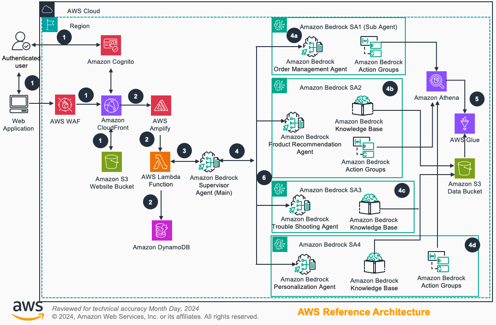
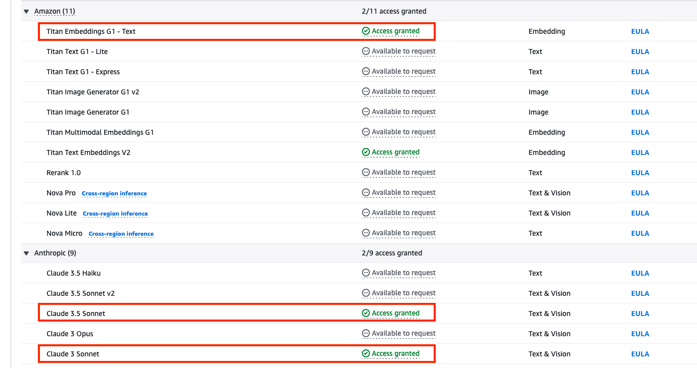
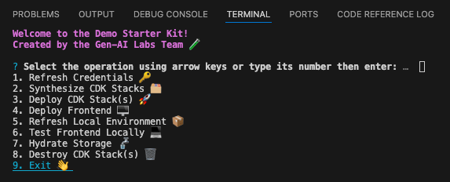
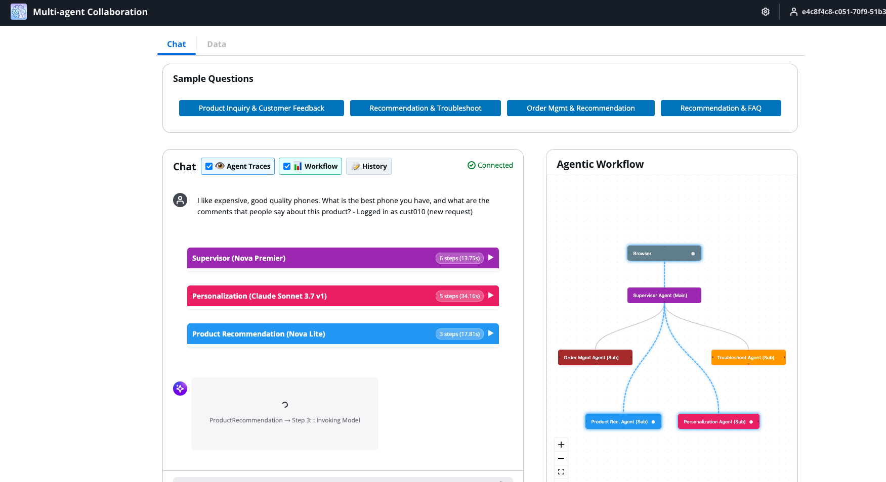

# Multi-agent Collaboration (Customer Support Assistant)

### Table of Contents
1. [Overview](#overview)
2. [Key Objectives](#key-objectives)
3. [Use Case: Intelligent Customer Support](#use-case-intelligent-customer-support)
4. [Agents Involved](#agents-involved)
5. [Runtime Chatbot](#runtime-chatbot)
6. [Architecture Design](#architecture-design)
7. [Demo Scope](#demo-scope)
   - a. [Natural Language Inquiry Handling](#natural-language-inquiry-handling)
   - b. [Order Tracking and Management](#order-tracking-and-management)
   - c. [Personalized Product Recommendations](#personalized-product-recommendations)
   - d. [Technical Issue Resolution](#technical-issue-resolution)
   - e. [Persistent Customer Profile for Personalized Service](#persistent-customer-profile-for-personalized-service)
   - f. [Dynamic Response and Tool Access](#dynamic-response-and-tool-access)
   - g. [Seamless Multi-Agent Coordination and Orchestration](#seamless-multi-agent-coordination-and-orchestration)
8. [Getting started](#getting-started)
9. [Cost](#cost)
10. [Model access](#model-access)
11. [Pre-Requisites](#pre-requisites)
12. [Setup](#setup)
   - [Clone repo & install dependencies](#clone-repo--install-dependencies)
   - [Bootstrapping Account](#bootstrapping-account)
   - [Setup website](#setup-website)
   - [Run webapp locally](#run-webapp-locally)
   - [Deploy Webapp to Amazon Cloudfront](#deploy-webapp-to-amazon-cloudfront)
13. [Cleanup](#cleanup)

## Overview  
This project focuses on developing and implementing robust multi-agent collaboration capabilities for Amazon Bedrock Agents. The goal is to enhance the platform's ability to handle complex, real-world business scenarios that require coordinated efforts across specialized AI agents. Multiple agents will gather information from various datasources by using semantic search, and creating SQL queries from natural language to fetch data from databases. Click [here](https://aws.storylane.io/share/otdlltvd8jz7) if interested in an interactive click through demo. 

### Key Objectives

- Develop a framework for efficient inter-agent communication
- Implement task decomposition and delegation mechanisms
- Ensure goal alignment across multiple agents
- Address foundational issues such as latency reduction and stability improvements
- Enhance usability to provide a solid base for multi-agent operations

## Use Case: Intelligent Customer Support

To demonstrate the capabilities of our multi-agent system, we've developed an intelligent customer support solution for a large retailer. This use case showcases how multiple specialized agents can collaborate to provide comprehensive, personalized support to customers.

### Agents Involved

1. Supervisor Agent
2. Order Management Agent
3. Product Recommendation Agent
4. Troubleshooting Agent
5. Personalization Agent


## Runtime Chatbot
The runtime chatbot is a React-based website that uses a WebSocket API and a Lambda function architecture. The Lambda function uses the Amazon Bedrock Converse API to reason and retrieve relevant documents from the knowledge base, and uses action groups for text-2-sql querying against an Amazon Athena database. Then, the app provides the final answer to users inquiring about products, troubleshooting, or purchase recommendations.


## Architecture Design



1. The user accesses the web application through ***AWS WAF*** and ***Amazon CloudFront***, which delivers content from the Amazon S3 Website bucket, while Amazon Cognito handles authentication.

2. After authentication, user requests are sent to ***AWS Amplify***, which serves as the entry point for all interactions. AWS Amplify validates the request and routes it to the appropriate ***AWS Lambda*** function for processing, maintaining a secure and scalable communication channel. ***Amazon DynamoDB*** is used to store session data. 

3. The ***AWS Lambda*** function processes the incoming request and communicates with the Amazon Bedrock Supervisor Agent (Main). 

4. The ***Amazon Bedrock*** Supervisor Agent (Main) analyzes the user query to determine intent and routes it to the appropriate sub agent. This central orchestrator maintains context across the conversation and ensures requests are handled by the most suitable sub agent.

4a. For order-related queries, the Order Management Agent retrieves data from the order management database in ***Amazon Athena***, accessing orders and inventory tables through its ***Action Groups*** that execute SQL queries and format structured responses about order status, shipping details, and inventory availability.

4b. When product recommendations are needed, this specialized agent accesses the product recommendation database in Athena while its Knowledge Base provides unstructured customer feedback data from S3, with Action Groups performing recommendation algorithms and formatting product suggestions with relevant details.

4c. For technical issues, the Troubleshooting Agent accesses its Knowledge Base containing FAQs and Troubleshooting Guide document collections, using vector search capabilities to match customer issues with relevant troubleshooting content and retrieve step-by-step solutions without requiring Action Groups.

4d. For personalization needs, the Personalization Agent accesses the personalization database in Athena, querying the customers preferences table through Action Groups that execute tailored SQL queries, perform preference analysis, and format responses. Its Knowledge Base contains browser history data from S3 that reveals actual customer behavior patterns, complementing the structured data to create a comprehensive view of individual customer profiles and past interactions.

5. Sub agents construct and execute SQL queries against Amazon Athena which uses the AWS Glue Data Catalog to understand the schema and location of data, then queries the data directly in Amazon S3 without requiring data movement or transformation.

6. After gathering necessary information from databases and knowledge bases, the sub agents generates a comprehensive response, which is then sent back through the Supervisor Agent to the Lambda function, AWS Amplify, and finally to the user's web interface.


## Demo Scope

1. **Natural Language Inquiry Handling**  
   The Customer Intake Agent captures the customer’s inquiry in natural language, interprets the intent, and routes it to the appropriate specialized agent (e.g., Order Management, Product Recommendation, or Troubleshooting).

2. **Order Tracking and Management**  
   The Order Management Agent retrieves real-time order details, including tracking information, and processes requests for returns or exchanges. This agent responds to the user’s questions about their orders, providing quick resolutions.

3. **Personalized Product Recommendations**  
   The Product Recommendation Agent analyzes customer purchase history, browsing patterns, and preferences to suggest relevant products tailored to the customer’s interests.

4. **Technical Issue Resolution**  
   The Troubleshooting Agent assists with diagnosing and resolving product-related issues by leveraging a knowledge base of common problems, troubleshooting guides, and customer support FAQs.

5. **Persistent Customer Profile for Personalized Service**  
   The Personalization Agent maintains and updates a customer profile, allowing it to recall previous interactions and provide personalized responses across multiple support sessions.

6. **Dynamic Response and Tool Access**  
   Agents dynamically select and access different tools and data sources, such as databases for order details, product catalogs, and survey data, ensuring comprehensive answers to customer inquiries.

7. **Seamless Multi-Agent Coordination and Orchestration**  
   The Orchestration Agent monitors agent progress, manages inter-agent communication, and ensures a seamless customer experience by coordinating the efforts of the Customer Intake, specialized, and Personalization agents.


This demo scope showcases the multi-agent system’s ability to deliver an efficient, personalized, and user-friendly customer support experience. The setup leverages Bedrock's orchestration and data-handling capabilities to deliver comprehensive and real-time support solutions.


## Getting started
Let's start by enabling the models we need for the application. Navigate to the Amazon Bedrock console, and enable the following models:

## Cost
You are responsible for the cost of the AWS services used while running this Guidance. As of October 2024, the cost for running this Guidance with the default settings in the US West (Oregon) AWS Region is approximately $606.14 per month for processing 100,000 requests with an input/output token count average of 700K.

We recommend creating a [Budget](https://docs.aws.amazon.com/cost-management/latest/userguide/budgets-managing-costs.html) through [AWS Cost Explorer](https://aws.amazon.com/aws-cost-management/aws-cost-explorer/) to help manage costs. Prices are subject to change. For full details, refer to the pricing webpage for each AWS service used in this Guidance.

| AWS Service                                           | Dimensions                                | Cost [USD]  |
|-------------------------------------------------------|-------------------------------------------|-------------|
| Amazon Cognito| Optimization Rate for Token Requests (0), Optimization Rate for App Clients (0), Number of monthly active users (MAU) (500), Advanced security features (Enabled)	| $25.00 |
| AWS WAF	| Number of Web Access Control Lists (Web ACLs) utilized (1 per month), Number of Rules added per Web ACL (3 per month), Number of Rule Groups per Web ACL (2 per month), Number of Rules inside each Rule Group (2 per month)	| $14.00 |
| Amazon CloudFront	| Data transfer out to internet (5 GB per month), Number of requests (HTTPS) (100000 per month), Data transfer out to origin (5 GB per month)	| $0.63 | 
| AWS Amplify |	Duration of each request (in ms) (500), Number of build minutes (240 per day), Data stored per month (100 GB)	| $75.30 |
| Amazon S3 | S3 Standard storage (10 GB per month), PUT, COPY, POST, LIST requests to S3 Standard (1000), GET, SELECT, and all other requests from S3 Standard (1000) |	$0.24 |
| AWS Lambda |	Architecture (x86), Architecture (x86), Invoke Mode (Buffered), Amount of ephemeral storage allocated (512 MB), Number of requests (1 million per month)	| $0.00 |
| Amazon DynamoDB |	Table class (Standard), Average item size (all attributes) (100 KB), Data storage size (10 GB)	| $3.15 |
| Amazon Bedrock (Agents) |	Average of 1,000 tokens input and 500 tokens output per invocation, Using Claude 3 Sonnet model (3/1Minputtokens,15/1M output tokens)	| |
| Supervisor Agent |	2,500 invocations/month	| $26.25 |
| Order Management Agent	| 1,000 invocations/month |	$10.50 |
| Product Recommendation Agent |	750 invocations/month	| $7.88 |
| Trouble Shooting Agent |	500 invocations/month	| $5.25 |
| Personalization Agent |	250 invocations/month	| $2.63 |
| Agent Builder Service Fee	| 5 agents × 0.0025perrequest×5,000requests	| $62.50 |
| Amazon Bedrock Knowledge Bases |	4 knowledge bases, 3 GB data each, 2,500 queries per month |	$507.48 | 
| Amazon Bedrock Action Groups	| Included in Bedrock Agent pricing |	$0 |
| Amazon Athena	| Amount of data scanned per query (1 GB), Total number of queries (100 per day)	| $14.85 |
| AWS Glue |	Number of DPUs for Apache Spark job (12), Number of DPUs for Python Shell job (0.0625) |	$5.28 |
|Total| | $760.94 |


### Model access

Navigate to the Amazon Bedrock console, and enable the following models: 
`Cohere Embed English V3`
`Nova Pro`
`Nova Lite`
`Nova Micro`
`Sonnet 3.5 V1`
`Claude 3 Haiku`
`Sonnet 3.5 V2`
`Haiku 3.5 V1`



## Pre-Requisites

### Run Docker

Because of restrictions of licensing on [Docker in Docker support](https://gitlab.pages.aws.dev/docs/Platform/gitlab-cicd.html#shared-runner-fleet), an alternative will need to be used. Success was found using [Rancher Desktop](https://rancherdesktop.io/), but you can use your Docker engine of choice. After install, you will need to allow the image `public.ecr.aws/sam/build-python3.12:latest` for the Python 3.12 build found on our official site [here](https://gallery.ecr.aws/sam/build-python3.12). 


### AWS CLI

Install `aws-cli` from [here](https://aws.amazon.com/cli/). Now, we need to configure our credentials.

```bash
aws configure
AWS Access Key ID [**********************]: 
AWS Secret Access Key [********************]:
Default region name us-east-1
Default output format: json

```

---

## Setup


### Clone repo & install dependencies
clone the repo from <https://github.com/awslabs/genai-labs-mac-demo-customer-support>

```bash
cd /project-root/
gh repo clone awslabs/genai-labs-mac-demo-customer-support
```

We are all set to install dependencies by using the following command. This will install `npm` dependencies required to run the app. Then, we will boostratp the account.

```bash
npm i
```

### Bootstrapping account

```bash
cdk bootstrap aws://{ACCOUNT_ID}/{REGION}
```

### Setup environment variables for Bedrock agents

This application uses environment variables to manage Amazon Bedrock agent IDs securely, with values **dynamically exported from the CDK stack** during deployment. This approach eliminates hardcoded IDs in any source code or configuration files.

#### For production deployments:
The CDK stack automatically:
1. Creates and configures the Bedrock agents
2. Extracts the generated agent IDs and alias IDs
3. Passes these as environment variables to the frontend build process
4. Injects them into the application at build time

#### For local development:
After deploying the CDK stack, we can set up the environment:


### Project Config

The project configuration requires you to enter in your account number. This is configured in the config/[project-config.json](/config/project-config.json) file.

Edit the variables -

```ts
    "accounts": {
        "dev": {
            "number": "{ACCOUNT_NUMBER}",
            "region": "us-east-1"
        }
    }
```

### Setup website using the Starter kit

Run this command to start the starter kit. 

```bash
npm run develop
```




This starter kit includes ready-to-deploy, compliant and secure CDK and React app components with Cognito integration. It also includes customizable CLI tooling for easier demo configuration and management. While we offer this set of components and tools, you retain the freedom to customize any and all aspects of the starter kit to fit your use case (even if it has nothing to do with GenAI).


To deploy the stack, select the option - ***3. Deploy CDK Stack(s) 🚀***. Select environment, then yes, and let it deploy.

Next, select the option ***5. Deploy Frontend 🖥️***. Let it finish deploying. 

### Amazon Athena
- Before we run the app, we need to manually set the Amazon Athena output bucket (This will be automated on the next revision). In the AWS console, search for the Amazon Athena service, then navigate to the Athena management console. Validate that the ***Query your data with Trino SQL*** radio button is selected, then press ***Launch query editor***.


- Next, set the ***query result location*** with Amazon S3. Select the ***Settings*** tab, then the ***Manage*** button in the ***Query result location and encryption*** section.


- Add the S3 prefix below for the query results location, then select the ***Save*** button.
```bash
s3://dev-mac-demo-backend-storageathenaresultsbucket-xxx
```


You are now ready to log into the application for testing.


### Run webapp locally

The local site is configured to run on port `3000`. So, ensure there are no other apps running on that port.

Select the option ***7. Test Frontend Locally 💻***.

Now, visit <http://localhost:3000> on a browser of choice (Chrome/Firefox are recommended)

If you receive a blank screen, refresh the page.

You also have a the cloudfront url created in the terminal to access the application.




---


## Authors and acknowledgment

Show your appreciation to those who have contributed to the project.

## License

[Amazon Software License 1.0](/LICENSE)
