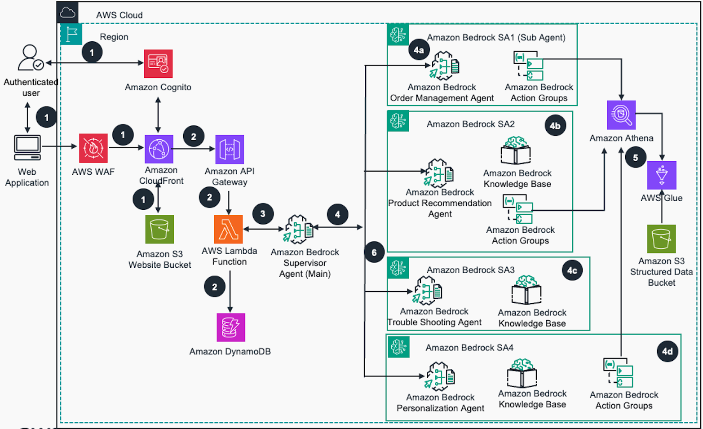
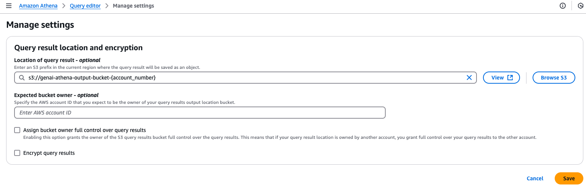
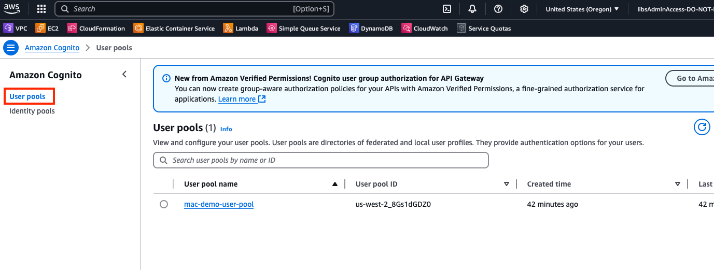
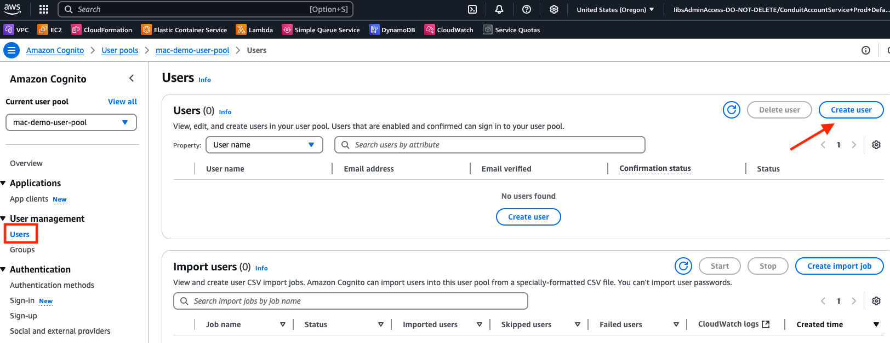
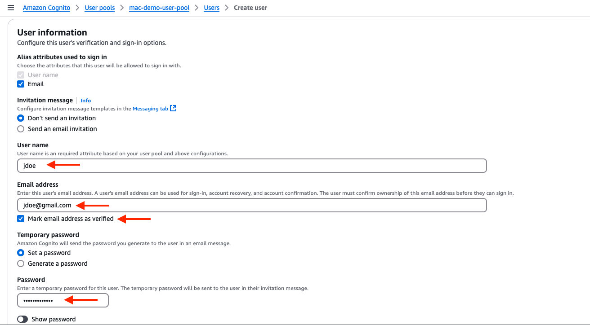
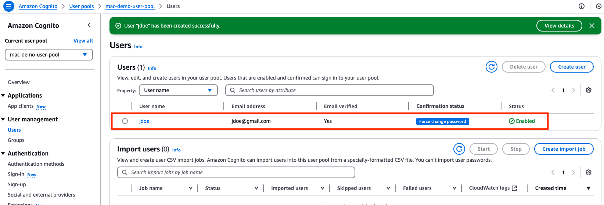

# Multi-agent Collaboration (Customer Support Assistant)

### Table of Contents
1. [Overview](#overview)
2. [Key Objectives](#key-objectives)
3. [Use Case: Intelligent Customer Support](#use-case-intelligent-customer-support)
4. [Agents Involved](#agents-involved)
5. [Runtime Chatbot](#runtime-chatbot)
6. [Architecture Diagram](#architecture-diagram)
7. [Demo Scope](#demo-scope)
   - a. [Natural Language Inquiry Handling](#natural-language-inquiry-handling)
   - b. [Order Tracking and Management](#order-tracking-and-management)
   - c. [Personalized Product Recommendationsn](#personalized-product-recommendations)
   - d. [Technical Issue Resolution](#technical-issue-resolution)
   - e. [Persistent Customer Profile for Personalized Service](#persistent-customer-profile-for-personalized-service)
   - f. [Dynamic Response and Tool Access](#dynamic-response-and-tool-access)
   - g. [Seamless Multi-Agent Coordination and Orchestration](#seamless-multi-agent-coordination-and-orchestration)
8. [Getting started](#getting-started)
9 [Cost](#cost)
10. [Model access](#model-access)
11. [Pre-Requisites](#pre-requisites)
12. [Setup](#setup)
   - [Clone repo & install dependencies](#clone-repo--install-dependencies)
   - [Bootstrapping Account](#bootstrapping-account)
   - [Setup website](#setup-website)
   - [Run webapp locally](#run-webapp-locally)
   - [Deploy Webapp to Amazon Cloudfront](#deploy-webapp-to-amazon-cloudfront)
13. [Cleanup](#cleanup)


## Overview  
This project focuses on developing and implementing robust multi-agent collaboration capabilities for Amazon Bedrock Agents. The goal is to enhance the platform's ability to handle complex, real-world business scenarios that require coordinated efforts across specialized AI agents. Multiple agents will gather information from various datasources by using semantic search, and creating SQL queries from natural language to fetch data from databases. Click [here](https://aws.storylane.io/share/otdlltvd8jz7) if interested in an interactive click through demo. 

### Key Objectives

- Develop a framework for efficient inter-agent communication
- Implement task decomposition and delegation mechanisms
- Ensure goal alignment across multiple agents
- Address foundational issues such as latency reduction and stability improvements
- Enhance usability to provide a solid base for multi-agent operations

## Use Case: Intelligent Customer Support

To demonstrate the capabilities of our multi-agent system, we've developed an intelligent customer support solution for a large retailer. This use case showcases how multiple specialized agents can collaborate to provide comprehensive, personalized support to customers.

### Agents Involved

1. Supervisor Agent
2. Order Management Agent
3. Product Recommendation Agent
4. Troubleshooting Agent
5. Personalization Agent

## Runtime Chatbot
The runtime chatbot is a React-based website that uses a WebSocket API and a Lambda function architecture. The Lambda function uses the Amazon Bedrock Converse API to reason and retrieve relevant documents from the knowledge base, and uses action groups for text-t2-sql querying against an Amazon Athena database. Then, the app provides the final answer to users inquiring about products, troubleshooting, or purchase recommendations.

## Architecture Design



## Demo Scope

#### **Natural Language Inquiry Handling**  
   The Customer Intake Agent captures the customer’s inquiry in natural language, interprets the intent, and routes it to the appropriate specialized agent (e.g., Order Management, Product Recommendation, or Troubleshooting).

#### **Order Tracking and Management**  
   The Order Management Agent retrieves real-time order details, including tracking information, and processes requests for returns or exchanges. This agent responds to the user’s questions about their orders, providing quick resolutions.

#### **Personalized Product Recommendations**  
   The Product Recommendation Agent analyzes customer purchase history, browsing patterns, and preferences to suggest relevant products tailored to the customer’s interests.

#### **Technical Issue Resolution**  
   The Troubleshooting Agent assists with diagnosing and resolving product-related issues by leveraging a knowledge base of common problems, troubleshooting guides, and customer support FAQs.

#### **Persistent Customer Profile for Personalized Service**  
   The Personalization Agent maintains and updates a customer profile, allowing it to recall previous interactions and provide personalized responses across multiple support sessions.

#### **Dynamic Response and Tool Access**  
   Agents dynamically select and access different tools and data sources, such as databases for order details, product catalogs, and survey data, ensuring comprehensive answers to customer inquiries.

#### **Seamless Multi-Agent Coordination and Orchestration**  
   The Orchestration Agent monitors agent progress, manages inter-agent communication, and ensures a seamless customer experience by coordinating the efforts of the Customer Intake, specialized, and Personalization agents.


This demo scope showcases the multi-agent system’s ability to deliver an efficient, personalized, and user-friendly customer support experience. The setup leverages Bedrock's orchestration and data-handling capabilities to deliver comprehensive and real-time support solutions.


## Getting started
Let's start by enabling the models we need for the application. Navigate to the Amazon Bedrock console, and enable the following models:

## Cost
You are responsible for the cost of the AWS services used while running this Guidance. As of October 2024, the cost for running this Guidance with the default settings in the US West (Oregon) AWS Region is approximately $606.14 per month for processing 100,000 requests with an input/output token count average of 700K.

We recommend creating a [Budget](https://docs.aws.amazon.com/cost-management/latest/userguide/budgets-managing-costs.html) through [AWS Cost Explorer](https://aws.amazon.com/aws-cost-management/aws-cost-explorer/) to help manage costs. Prices are subject to change. For full details, refer to the pricing webpage for each AWS service used in this Guidance.

| AWS Service                                           | Dimensions                                | Cost [USD]  |
|-------------------------------------------------------|-------------------------------------------|-------------|
| Amazon Cognito| Optimization Rate for Token Requests (0), Optimization Rate for App Clients (0), Number of monthly active users (MAU) (500), Advanced security features (Enabled)	| $25.00 |
| AWS WAF	| Number of Web Access Control Lists (Web ACLs) utilized (1 per month), Number of Rules added per Web ACL (3 per month), Number of Rule Groups per Web ACL (2 per month), Number of Rules inside each Rule Group (2 per month)	| $14.00 |
| Amazon CloudFront	| Data transfer out to internet (5 GB per month), Number of requests (HTTPS) (100000 per month), Data transfer out to origin (5 GB per month)	| $0.63 | 
| Amazon API Gateway |	HTTP API requests units (millions), Average size of each request (34 KB), REST API request units (millions), Cache memory size (GB) (None), WebSocket message units (thousands), Average message size (32 KB), Requests ( per month), Requests (1 per month)	| $3.50 |
| Amazon S3 | S3 Standard storage (10 GB per month), PUT, COPY, POST, LIST requests to S3 Standard (1000), GET, SELECT, and all other requests from S3 Standard (1000) |	$0.24 |
| AWS Lambda |	Architecture (x86), Architecture (x86), Invoke Mode (Buffered), Amount of ephemeral storage allocated (512 MB), Number of requests (1 million per month)	| $0.00 |
| Amazon DynamoDB |	Table class (Standard), Average item size (all attributes) (100 KB), Data storage size (10 GB)	| $3.15 |
| Amazon Bedrock (Agents) |	Average of 1,000 tokens input and 500 tokens output per invocation, Using Claude 3 Sonnet model (3/1Minputtokens,15/1M output tokens)	| |
| Supervisor Agent |	2,500 invocations/month	| $26.25 |
| Order Management Agent	| 1,000 invocations/month |	$10.50 |
| Product Recommendation Agent |	750 invocations/month	| $7.88 |
| Trouble Shooting Agent |	500 invocations/month	| $5.25 |
| Personalization Agent |	250 invocations/month	| $2.63 |
| Agent Builder Service Fee	| 5 agents × 0.0025perrequest×5,000requests	| $62.50 |
| Amazon Bedrock Knowledge Bases |	4 knowledge bases, 3 GB data each, 2,500 queries per month |	$507.48 | 
| Amazon Bedrock Action Groups	| Included in Bedrock Agent pricing |	$0 |
| Amazon Athena	| Amount of data scanned per query (1 GB), Total number of queries (100 per day)	| $14.85 |
| AWS Glue |	Number of DPUs for Apache Spark job (12), Number of DPUs for Python Shell job (0.0625) |	$5.28 |
|Total| | $689 |


### Model access

Navigate to the Amazon Bedrock console, and enable the following models: 
`Titan Embeddings G1 - Text`
`Cohere Embed English V3`
`Nova Pro`
`Nova Lite`
`Nova Micro`
`Sonnet 3.5 V1`
`Sonnet 3.5 V2`
`Sonnet 3`
`Haiku 3.5 V1`


## Pre-Requisites

### Volta

We use `volta` to manage `nodejs` installation & version management. Get `volta` from [here](https://docs.volta.sh/guide/understanding).

```bash
volta install node@22.6.0

# check node version 
node --version 
v22.6.0
```


### Run Docker

Because of restrictions of licensing on [Docker in Docker support](https://gitlab.pages.aws.dev/docs/Platform/gitlab-cicd.html#shared-runner-fleet), an alternative will need to be used. Success was found using [Rancher Desktop](https://rancherdesktop.io/), but you can use your Docker engine of choice. After install, you will need to allow the image `public.ecr.aws/sam/build-python3.12:latest` for the Python 3.12 build found on our official site [here](https://gallery.ecr.aws/sam/build-python3.12). 


### AWS CLI

Install `aws-cli` from [here](https://aws.amazon.com/cli/). After getting the credentials from `ada` above lets configure the region as `us-west-2`

```bash
aws configure
AWS Access Key ID [**********************]: 
AWS Secret Access Key [********************]:
Default region name us-west-2
Default output format: json

OR

export AWS_ACCESS_KEY_ID=[**********************]
export AWS_SECRET_ACCESS_KEY=[**********************]
export AWS_DEFAULT_REGION=us-west-2

```

---

## Setup


### Clone repo & install dependencies
clone the repo from <https://github.com/awslabs/genai-labs-mac-demo-customer-support>


```bash
cd /project-root/
gh repo clone awslabs/genai-labs-mac-demo-customer-support
```

We are all set to install dependencies by using the following command. This will install `npm` dependencies from our internal AWS CodeArtifact repository and will take at-least 2-5 mins to complete for first time. Great time for a ☕

```bash
npm run install:all
```

### Bootstrapping account

```bash
cdk bootstrap aws://{ACCOUNT_ID}/{REGION}
```

### Setup website

Next up we will setup the website to run locally to make changes, then deploy the app to Cloudfront. This requires to generate the `.env` file locally which has all backend infra ARNs and several key resource identifiers. This can be easily done via a script

Make sure to navigate to the packages/infra/config/***AppConfig.ts*** file and update the **projectName**, and **currentAccount**.

```bash
# from project root
cd /project-root/ 

# manually deploy infra via cdk 
npm run -w infra deploy-infra

# build the web-app
npm run -w infra build-webapp
```

If you get the following error on deployment:
`Unable to find image 'public.ecr.aws/sam/build-python3.12:latest' locally`

Run these commands:

```bash
docker logout public.ecr.aws

npm run -w infra deploy-infra

npm run -w infra build-webapp
```


- Before we run the app, we need to manually set the Amazon Athena output bucket (This will be automated on the next revision). In the AWS console, search for the Amazon Athena service, then navigate to the Athena management console. Validate that the ***Query your data with Trino SQL*** radio button is selected, then press ***Launch query editor***.


- Next, set the ***query result location*** with Amazon S3. Select the ***Settings*** tab, then the ***Manage*** button in the ***Query result location and encryption*** section.


- Add the S3 prefix below for the query results location, then select the ***Save*** button.
```bash
s3://genai-athena-output-bucket-{account_number}
```



- The last thing we need to do before we can access the application is to add in a user in Amazon Cognito. Navigate to the Amazon Cognito management console. Once there, select **User pools** on the left.



- Select ***Users*** on the left under the ***User management*** dropdown, then select the **Create user** button on the right.



- Here, you will enter in a ***User name, Email address***, and ***Password***. Be sure to check the box for ***Mark email address as verified***. After, select the ***Create user*** on the bottom right.



- Now, in the **Users** section, you should see the user created. You are now ready to log into the application for testing.



### Run webapp locally

The local site is configured to run on port `3000`. So, ensure there are no other apps running on that port.

Run the following commands:

```bash
cd /project-root/ 
#locally run webapp
npm run -w webapp dev
```

Now, visit <http://localhost:3000> on a browser of choice (Chrome/Firefox are recommended)

---

### Deploy webapp to Amazon Cloudfront
```bash
### Deploy webapp to Amazon Cloudfront
npm run -w infra deploy-website
```

***(If you change any of the models on the agents, make sure to update the Alias to a new version afterwards. Do not create any new aliases for the agents.)***


## Cleanup
After completing the setup and testing of the Bedrock Agent, follow these steps to clean up your AWS environment and avoid unnecessary charges:

Run this command from root directory (make sure docker is running):

```bash
npm run delete:stack
```

If it stalls, just continue to press `ENTER`, then ctrl + c.

This command will execute the `rollback-mac-demo.sh` script which:

1. Empties all S3 buckets with the "mac-demo" prefix
2. Deletes Lambda functions created by the deployment
3. Disables delete protection on the DynamoDB table
4. Disables and deletes CloudFront distributions
5. Removes WAF WebACLs (both regional and global)
6. Deletes all CloudFormation stacks in the proper order

When you run this command, the script will:
- Ask for confirmation before proceeding
- Show detailed progress for each step
- Handle errors gracefully
- Clean up resources in the correct order

If some services fail to delete, proceed to deleting the remaining stakcs from the AWS Cloudformation mangement console.

## Authors and acknowledgment

Show your appreciation to those who have contributed to the project!

## Development Guidelines

### Adding License Headers

This project requires all source code files to include a license header. To add license headers to your files, run:

```bash
./scripts/add-license-headers.sh
```

This script will automatically add the appropriate MIT-0 license header to all JavaScript, TypeScript, React, and CSS files that don't already have one.

## License

[Amazon Software License 1.0](/LICENSE)
