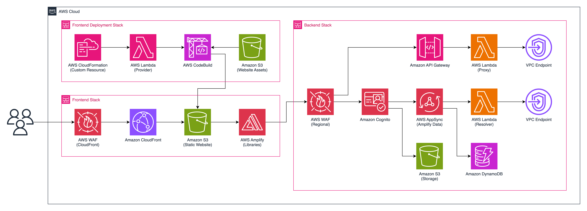

# Multi-agent Collaboration (Customer Support Assistant)

## Storylane URL: 

(Passcode: P05tR1VBedrock2024)


## Overview  
This project focuses on developing and implementing robust multi-agent collaboration capabilities for Amazon Bedrock Agents. The goal is to enhance the platform's ability to handle complex, real-world business scenarios that require coordinated efforts across specialized AI agents. Multiple agents will gather information from various datasources by using semantic search, and creating SQL queries from natural language to fetch data from databases.

### Key Objectives

- Develop a framework for efficient inter-agent communication
- Implement task decomposition and delegation mechanisms
- Ensure goal alignment across multiple agents
- Address foundational issues such as latency reduction and stability improvements
- Enhance usability to provide a solid base for multi-agent operations

## Use Case: Intelligent Customer Support

To demonstrate the capabilities of our multi-agent system, we've developed an intelligent customer support solution for a large retailer. This use case showcases how multiple specialized agents can collaborate to provide comprehensive, personalized support to customers.

### Agents Involved

1. Supervisor Agent
2. Order Management Agent
3. Product Recommendation Agent
4. Troubleshooting Agent
5. Personalization Agent

## Architecture Diagram




Here is another diagram breaking down the workflow:


1. The user accesses the web application through **AWS WAF*** and ***Amazon CloudFront***, which delivers content from the Amazon S3 Website bucket, while Amazon Cognito handles authentication.

2. After authentication, user requests are sent to ***AWS Amplify***, which serves as the entry point for all interactions. AWS Amplify validates the request and routes it to the appropriate ***AWS Lambda*** function for processing, maintaining a secure and scalable communication channel. ***Amazon DynamoDB*** is used to store session data. 

3. The ***AWS Lambda*** function processes the incoming request and communicates with the Amazon Bedrock Supervisor Agent (Main). 

4. The ***Amazon Bedrock*** Supervisor Agent (Main) analyzes the user query to determine intent and routes it to the appropriate sub agent. This central orchestrator maintains context across the conversation and ensures requests are handled by the most suitable sub agent.

4a. For order-related queries, the Order Management Agent retrieves data from the order management database in ***Amazon Athena***, accessing orders and inventory tables through its ***Action Groups*** that execute SQL queries and format structured responses about order status, shipping details, and inventory availability.

4b. When product recommendations are needed, this specialized agent accesses the product recommendation database in Athena while its Knowledge Base provides unstructured customer feedback data from S3, with Action Groups performing recommendation algorithms and formatting product suggestions with relevant details.

4c. For technical issues, the Troubleshooting Agent accesses its Knowledge Base containing FAQs and Troubleshooting Guide document collections, using vector search capabilities to match customer issues with relevant troubleshooting content and retrieve step-by-step solutions without requiring Action Groups.

4d. For personalization needs, the Personalization Agent accesses the personalization database in Athena, querying the customers preferences table through Action Groups that execute tailored SQL queries, perform preference analysis, and format responses. Its Knowledge Base contains browser history data from S3 that reveals actual customer behavior patterns, complementing the structured data to create a comprehensive view of individual customer profiles and past interactions.

5. Sub agents construct and execute SQL queries against Amazon Athena which uses the AWS Glue Data Catalog to understand the schema and location of data, then queries the data directly in Amazon S3 without requiring data movement or transformation.

6. After gathering necessary information from databases and knowledge bases, the sub agents generates a comprehensive response, which is then sent back through the Supervisor Agent to the Lambda function, AWS Amplify, and finally to the user's web interface.


## Demo Scope

1. **Natural Language Inquiry Handling**  
   The Customer Intake Agent captures the customer’s inquiry in natural language, interprets the intent, and routes it to the appropriate specialized agent (e.g., Order Management, Product Recommendation, or Troubleshooting).

2. **Order Tracking and Management**  
   The Order Management Agent retrieves real-time order details, including tracking information, and processes requests for returns or exchanges. This agent responds to the user’s questions about their orders, providing quick resolutions.

3. **Personalized Product Recommendations**  
   The Product Recommendation Agent analyzes customer purchase history, browsing patterns, and preferences to suggest relevant products tailored to the customer’s interests.

4. **Technical Issue Resolution**  
   The Troubleshooting Agent assists with diagnosing and resolving product-related issues by leveraging a knowledge base of common problems, troubleshooting guides, and customer support FAQs.

5. **Persistent Customer Profile for Personalized Service**  
   The Personalization Agent maintains and updates a customer profile, allowing it to recall previous interactions and provide personalized responses across multiple support sessions.

6. **Dynamic Response and Tool Access**  
   Agents dynamically select and access different tools and data sources, such as databases for order details, product catalogs, and survey data, ensuring comprehensive answers to customer inquiries.

7. **Seamless Multi-Agent Coordination and Orchestration**  
   The Orchestration Agent monitors agent progress, manages inter-agent communication, and ensures a seamless customer experience by coordinating the efforts of the Customer Intake, specialized, and Personalization agents.


This demo scope showcases the multi-agent system’s ability to deliver an efficient, personalized, and user-friendly customer support experience. The setup leverages Bedrock's orchestration and data-handling capabilities to deliver comprehensive and real-time support solutions.


## Getting started
Let's start by enabling the models we need for the application. Navigate to the Amazon Bedrock console, and enable the following models:

### Model access

Navigate to the Amazon Bedrock console, and enable the following models: 
`Titan Embeddings G1 - Text`
`Cohere Embed English V3`
`Nova Pro`
`Nova Lite`
`Nova Micro`
`Sonnet 3.5 V1`
`Sonnet 3.5 V2`
`Haiku 3.5 V1`


### Run Docker

Because of restrictions of licensing on [Docker in Docker support](https://gitlab.pages.aws.dev/docs/Platform/gitlab-cicd.html#shared-runner-fleet), an alternative will need to be used. Success was found using [Rancher Desktop](https://rancherdesktop.io/), but you can use your Docker engine of choice. After install, you will need to allow the image `public.ecr.aws/sam/build-python3.12:latest` for the Python 3.12 build found on our official site [here](https://gallery.ecr.aws/sam/build-python3.12). 


### AWS CLI

Install `aws-cli` from [here](https://aws.amazon.com/cli/). After getting the credentials from `ada` above lets configure the region as `us-west-2`

```bash
aws configure
AWS Access Key ID [**********************]: 
AWS Secret Access Key [********************]:
Default region name us-west-2
Default output format: json

```

---

## Repo Setup

clone the repo from <https://gitlab.aws.dev/genai-labs/demo-assets/multiagent-collaboration>

```bash
git clone git@ssh.gitlab.aws.dev:genai-labs/demo-assets/mac-customer-support.git
```


### Project Config

The project configuration requires you to enter in your account number. This is configured in the config/[project-config.json](/config/project-config.json) file.

Edit the variables -

```ts
    "accounts": {
        "dev": {
            "number": "{ACCOUNT_NUMBER}",
            "region": "us-west-2",
            "midwaySecretId": "abc123"
        },
        "prod": {
            "number": "{ACCOUNT_NUMBER}",
            "region": "us-west-2",
            "midwaySecretId": "abc123"
        }
    }
```

### Code defender

[Code Defender](https://w.amazon.com/bin/view/AWS/Teams/GlobalServicesSecurity/Engineering/CodeDefender/UserHelp/#5) is a AWS Sales, Marketing, & Global Services (SMGS) security service that leadership has invested in and mandated to protect and safeguard our customers.
This service validates Git activity and adds an additional layer of protection to users and our customers by ensuring users are not releasing AWS Secrets (Keys, Tokens, Account ARNs) or AWS and our customer's code to incorrect or publicly accessible repositories. Please take a look at our [wiki](https://w.amazon.com/bin/view/AWS/Teams/GlobalServicesSecurity/Engineering/CodeDefender/) if you'd like more details.

### Install dependencies

Install the required dependencies for the project

```bash
cd {root_directory}

npm run i
```

### Bootstrapping Account

```bash
cdk bootstrap aws://959664613099/us-east-1
```


### Setup website using the Starter kit

Run this command to start the starter kit. 

```bash
npm run develop
```


This starter kit includes ready-to-deploy, compliant and secure CDK and React app components with Cognito integration. It also includes customizable CLI tooling for easier demo configuration and management. While we offer this set of components and tools, you retain the freedom to customize any and all aspects of the starter kit to fit your use case (even if it has nothing to do with GenAI).


To deploy the stack, select the option - ***3. Deploy CDK Stack(s) 🚀***. Select environment, then yes, and let it deploy.

Next, select the option ***5. Deploy Frontend 🖥️***. Let it finish deploying. 


### Run webapp locally

The local site is configured to run on port `3000`. So, ensure there are no other apps running on that port.

Select the option ***7. Test Frontend Locally 💻***.

Now, visit <http://localhost:3000> on a browser of choice (Chrome/Firefox are recommended)

---

You can also see that you have a cloudfront url in the terminal that you can access the application.


## Authors and acknowledgment

Show your appreciation to those who have contributed to the project.

## License

[Amazon Software License 1.0](/LICENSE)
